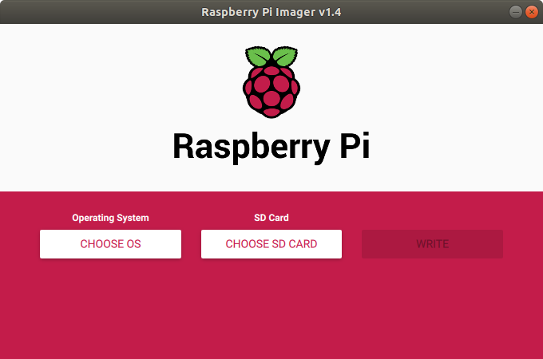

# Raspberry Pi image capture and send to server via RestAPI

A basic set of Python scripts to capture image on a Raspberry Pi and send it to a server via RestAPI.  This documentation comprises of the following parts

- Raspberry Pi OS and headless setup
- Installation of pip, picamera and requests libraries
- Python script to capture image, encode and send via HTTP requests
- crontab settings
- Python/Flask script for RestAPI

This repository doesn't intent to provide advance RestAPI setup, such as using JWT nor database driven.  It serves as a starter for those wanting to start somewhere.

## Raspberry Pi OS (Raspbian) and headless setup

Download the Raspberry Pi Imager for your OS from https://www.raspberrypi.org/downloads/.  Start the Pi Imager



Select the "Raspberry Pi OS (Other)" and then select the "Raspberry Pi OS Lite (32 Bit)".  We are selecting this as we do not need to load up the heavy GUI interface and we want a minimal Raspberry Pi OS image.  Then select your appropriate SD Card to write to and click on the "WRITE" button.  This stage will take some time to complete.

### Headless

The term headless device (computer) is a device that can operate without a monitor (the "headless"), keyboard, and mouse. A headless device is typically controlled over a network connection, and in our case, it is via a Secure SHell (SSH) connection over the network.  There are 2 main task (one more if you want to fix the IP address to access the device) which is to

1. Ensure that the SSH port is open
2. The Raspberry Pi is connected to a network (in our case, a wireless network)

#### Enable SSH

After the image has been written to the SD Card, the SD Card can be access via your file explorer / manager and there will be two folders.  The ```boot``` and ```raspfs```.  In the ```boot``` folder, create an empty (or you can enter any text) file called ```ssh``` (with no file extension) and also a file called ```wpa_supplicant.conf``` with the following content,

```
country=my
update_config=1
ctrl_interface=/var/run/wpa_supplicant

network={
  scan_ssid=1
  ssid="ian@timebb"
  psk="0122018108"
}
```

You now should have a raspberry pi that you can boot and will connect to your local wi-fi.  The only thing is that it is by default using DHCP and hence you need to be able to access your wi-fi router and find out the IP number that it obtained through the DHCP.  We call it the ```pi_IP_number``` as a reference here.  Open up a shell (or even your Windows command line interface) and type in

~~~
ssh pi@<pi_IP_number>
~~~

The default password on the Raspberry Pi for the user ID ```pi``` is ```raspberry```.

## Installation of pip, picamera and requests library

Should already have python installed

~~~
sudo apt-get install python-pip
sudo pip install picamera
sudo pip install requests
~~~

## Python script to capture image, encode and send via HTTP requests

~~~
#!/usr/bin/python

from picamera import PiCamera
import requests
import base64

myUrl = 'http://<Your_Hostname_or_IP/API_Path>'
camera = PiCamera()

camera.capture('image.jpg')
encoded64 = base64.encodestring(open('image.jpg', 'rb').read())

response = requests.post(myUrl, data=encoded64, headers={'content-type':'image/jpeg'})
~~~

## crontab settings

### Understanding crontab

A file setting located at ```/etc/crontab``` is a UNIX scheduler.  The format of the scheduler is 5 numerical numbers followed by the command to execute.  The 5 numerical values represents:

- m minute
- h hour
- d day of month
- m month 1-12
- w weekday 0-7, Sun,Mon, etc (Sunday = 0 = 7) It is easy to remember if you think of the way one would say a date: Wednesday, July 29, at 10:30, then reverse the order.

For our case, we want to take a picture every 3 hours from 9 am to 6 pm (4 times a day) every day.  So we can set it as

```
0 9,12,15,18 * * * /home/pi/click.py
```

The 2nd set of numbers are the range separated by commas with no space.  Note that you should have your own crontab file, create your own file in the pi home directory and enter those lines above. Then run

```
sudo crontab -e
```

Check that it is in the crontab list and restart the cron service.
```
sudo crontab -l
sudo service cron restart
```

## Python/Flask script for RestAPI

On the server, not on the Pi, you will also need to have the right libraries.  For image processing, you may want to use OpenCV and you can install it using

~~~
sudo pip install python-opencv
~~~


~~~
~~~
